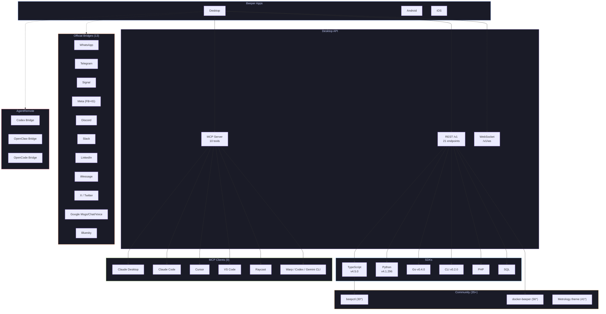

<p align="center">
  
</p>

<h1 align="center">
  <code>beeper-intel</code>
</h1>

<p align="center">
  <strong>Intelligence dashboard for the Beeper messaging ecosystem</strong><br/>
  <em>Repos, APIs, bridges, community tools, and strategic signals -- all in one place.</em>
</p>

<p align="center">
  
  
  
  
  
  
  
</p>

---

## Executive Summary

<table>
<tr>
<td width="50%">

### AgentRemote: The AI Pivot

Beeper renamed `ai-bridge` to **`agentremote`** -- "All your agents in Beeper." Codex, OpenClaw, and OpenCode bridges connect AI agent runtimes directly into Beeper chat with full history, streaming, and tool approvals.

**3 bridges near ready for testing** (Mar 6, 2026)

</td>
<td width="50%">

### AI Chats: Imminent

Built-in AI chat capability **"coming very soon"** (Mar 4, 2026). Image forwarding for questions and image descriptions planned. Translation feature already running in nightlies for 2 months, unreleased.

</td>
</tr>
<tr>
<td width="50%">

### 11 Documentation Gaps

Cross-referencing the official docs with 13,072 community messages reveals 11 significant gaps: no REST API reference page (404), undocumented WebSocket events, zero docs for AI features, AgentRemote, headless mode, or webhooks.

</td>
<td width="50%">

### Ecosystem Scale

**125** official repos, **35+** community projects, **6** SDKs, **13** bridges, **9** supported MCP clients, **21** API endpoints. Desktop API grew **75%** in 4 months.

</td>
</tr>
</table>

---

## Ecosystem Map



> Full interactive diagram with all 160+ repos: [`reports/ecosystem-map.md`](reports/ecosystem-map.md)

---

## GitHub Ecosystem

### Top Official Repositories

| Stars | Repository | Language | Description | Last Active |
|------:|-----------|----------|-------------|-------------|
| 1290 | [`bridge-manager`](https://github.com/beeper/bridge-manager) |  | Self-hosted bridge management | Mar 2026 |
| 1065 | [`self-host`](https://github.com/beeper/self-host) | - | Self-hosting docs |  |
| 1032 | [`imessage`](https://github.com/beeper/imessage) |  | iMessage bridge |  |
| 629 | [`beepy`](https://github.com/beeper/beepy) |  | Beepy hardware device | Mar 2026 |
| 156 | [`themes`](https://github.com/beeper/themes) |  | Community CSS themes | Mar 2026 |
| 150 | [`mac-registration-provider`](https://github.com/beeper/mac-registration-provider) |  | iMessage Mac registration | - |
| 70 | [`barcelona`](https://github.com/beeper/barcelona) |  | iMessage framework | - |
| 56 | [`docker-beeper`](https://github.com/zachatrocity/docker-beeper) |  | Desktop in browser (community) | - |
| 32 | [`aibot`](https://github.com/beeper/aibot) |  | ChatGPT bot for Matrix | - |
| 30 | [`beepctl`](https://github.com/blqke/beepctl) |  | CLI tool (community) | Mar 2026 |

<details>
<summary><strong>Very Active Repos (daily/weekly commits)</strong></summary>

| Repository | Stars | Language | Activity | Updated |
|-----------|------:|----------|----------|---------|
| [`platform-imessage`](https://github.com/beeper/platform-imessage) | 1 | Swift | Daily | Mar 9, 2026 |
| [`agentremote`](https://github.com/beeper/agentremote) | 11 | Go | Daily | Mar 9, 2026 |
| [`metabase`](https://github.com/beeper/metabase) | 0 | Clojure | Daily | Mar 9, 2026 |
| [`desktop-api-js`](https://github.com/beeper/desktop-api-js) | 21 | TypeScript | Weekly | Mar 8, 2026 |
| [`desktop-api-cli`](https://github.com/beeper/desktop-api-cli) | 5 | Go | Weekly | Mar 8, 2026 |
| [`chat-adapter-matrix`](https://github.com/beeper/chat-adapter-matrix) | 12 | TypeScript | Weekly | Mar 8, 2026 |
| [`bridge-manager`](https://github.com/beeper/bridge-manager) | 1290 | Go | Weekly | Mar 6, 2026 |
| [`desktop-api-openapi`](https://github.com/beeper/desktop-api-openapi) | - | YAML | Weekly | Mar 6, 2026 |

</details>

<details>
<summary><strong>Archived Repos (8)</strong></summary>

| Repository | Stars | Reason |
|-----------|------:|--------|
| `self-host` | 1065 | Docs moved to developers.beeper.com |
| `imessage` | 1032 | Replaced by platform-imessage (Swift) |
| `linkedin` | 102 | Merged into mautrix/linkedin |
| `linkedin-messaging-api` | 61 | Deprecated, moved to linkedin repo |
| `sdk-docs` | 42 | Docs moved to developers.beeper.com |
| `synapse-legacy-fork` | 7 | Old Synapse fork no longer needed |
| `mautrix-go` | 3 | Superseded by mautrix org |
| `signald` | 2 | Old Signal bridge replaced |

</details>

---

## API Timeline

### Desktop API Evolution

| Version | Date | Endpoints Added | Highlight |
|---------|------|:---------------:|-----------|
| **v4.1.294** | Oct 16, 2025 | ~12 | Major migration: gRPC `/v0` to REST `/v1` |
| **v4.2.499** | Jan 23, 2026 | +3 | Message editing, file uploads |
| **v4.2.509** | Jan 27, 2026 | +1 | Asset serving with range requests |
| **v4.2.557** | Feb 13, 2026 | +6 | WebSocket, reactions, discovery, contacts |
| | | **= 21** | **+75% growth in 4 months** |

### Current Endpoint Map

```
/v1/info                                          GET    Discovery
/v1/accounts                                      GET    List accounts
/v1/accounts/{id}/contacts/list                   GET    List contacts
/v1/chats                                         GET    List/search chats
/v1/chats                                         POST   Create chat
/v1/chats/{id}                                    GET    Get chat details
/v1/chats/{id}/archive                            PUT    Archive/unarchive
/v1/chats/{id}/reminder                           PUT    Set reminder
/v1/chats/{id}/messages                           GET    List messages
/v1/chats/{id}/messages                           POST   Send message
/v1/chats/{id}/messages/{mid}                     PUT    Edit message
/v1/chats/{id}/messages/{mid}/reactions            POST   Add reaction
/v1/chats/{id}/messages/{mid}/reactions            DELETE Remove reaction
/v1/search                                        GET    Unified search
/v1/search/users                                  GET    Search contacts
/v1/assets/upload                                 POST   Upload (multipart)
/v1/assets/upload/base64                          POST   Upload (base64)
/v1/assets/serve                                  GET    Stream asset
/v1/ws                                            GET    WebSocket events
/v1/open                                          POST   Focus app window
/v0/mcp                                           POST   MCP endpoint
```

> Full version-by-version changelog: [`timelines/api-evolution.md`](timelines/api-evolution.md)

---

## Desktop Changelog

<details>
<summary><strong>v4.2.630 -- Mar 9, 2026</strong></summary>

**New**: Search bar in Settings window

**Fixes**:
- iMessage reactions fixed on macOS Tahoe and Sequoia
- Performance improvements for faster chat catchup on launch
- Fixed missing names/avatars for chat participants
- Fixed unread count bugs and chats in wrong space after sidebar redesign
- Remind Me correctly uses "If no reply" default setting
- Fixed broken icons on Windows and Linux
- Fixed incomplete contact list when creating group Google Messages chats

</details>

<details>
<summary><strong>v4.2.605 -- Mar 3, 2026</strong></summary>

**New**: Redesigned account filters and sidebar (Space Bar)

**Fixes**:
- Multi-message forwarding restored
- Display name issues resolved
- Windows/Linux "Beeper is already running" warning fixed
- Image rotation direction fixed
- On-Device Telegram connection improvements for clock sync issues

</details>

<details>
<summary><strong>v4.2.587 -- Feb 24, 2026</strong></summary>

**Fixes**:
- Storage management shows accurate disk recovery calculations
- Warning for installing newer version while older running
- Location messages fully deleted on removal
- Menubar functionality fixed
- Signal replies, reactions, sent messages working for all users
- Old message deletion for Instagram and Facebook chats

</details>

<details>
<summary><strong>v4.2.564 -- Feb 17, 2026</strong></summary>

**New**: Disk usage management via Settings > Storage

**Fixes**:
- Emoji rendering on Macs with Lockdown Mode
- Picture-in-Picture video improvements
- Telegram login retry for failed 2FA
- iMessage chat archiving enhanced
- Extra windows on launch eliminated
- Messenger audio message transcription fixed

</details>

---

## Documentation Gaps

11 gaps identified between shipped features and official documentation:

| # | Area | Severity | Status | Impact |
|:-:|------|:--------:|--------|--------|
| 7 | **Webhooks** |  | Not built yet | Real-time integrations blocked |
| 1 | **REST API Reference** |  | 404 page | No unified endpoint docs |
| 2 | **WebSocket Events** |  | Undocumented | Must reverse-engineer events |
| 5 | **AI Features** |  | Imminent, no docs | Can't prepare integrations |
| 6 | **AgentRemote** |  | Daily commits, no docs | Invisible to developers |
| 8 | **Headless Mode** |  | In development | Server deployment impossible |
| 3 | **MCP Tools List** |  | Incomplete | Must discover at runtime |
| 4 | **Translations** |  | In nightly ~2 months | Users unaware |
| 9 | **Send-Later API** |  | App-only | No API scheduling |
| 10 | **Python SDK Install** |  | SSH-only | High friction |
| 11 | **Dynamic Changelog** |  | JS-dependent | Can't scrape |

> Full analysis with evidence: [`reports/documentation-gaps.md`](reports/documentation-gaps.md)

---

## Community Projects

### CLI Tools & SDKs

| Project | Author | Stars | Language | Description |
|---------|--------|------:|----------|-------------|
| [`beepctl`](https://github.com/blqke/beepctl) | blqke | 30 |  | CLI for messaging from terminal |
| [`beeper-cli`](https://github.com/KrauseFx/beeper-cli) | KrauseFx | 25 |  | Read-only browse/search |
| [`BeeperPS`](https://github.com/AndrewPla/BeeperPS) | AndrewPla | 8 |  | PowerShell module |
| [`desktop-api-cli`](https://github.com/beeper/desktop-api-cli) | beeper | 5 |  | Official CLI v0.2.0 |

### MCP Servers

| Project | Author | Stars | Description |
|---------|--------|------:|-------------|
| [`desktop-api-mcp`](https://github.com/beeper/desktop-api-mcp) | beeper | 3 | Claude Desktop Extension (official) |
| [`mcp-android`](https://github.com/beeper/mcp-android) | beeper | 8 | Android MCP server (official) |
| [`poke-beeper-proxy`](https://github.com/keithah/poke-beeper-proxy) | keithah | 1 | macOS MCP tunnel daemon |
| [`beeper-mcp`](https://github.com/mimen/beeper-mcp) | mimen | 0 | Python MCP server |
| [`beeper-mcp-server`](https://github.com/stopWarByWar/beeper-mcp-server) | stopWarByWar | 1 | Python MCP server |

### Themes

| Theme | Author | Stars | Style |
|-------|--------|------:|-------|
| [`Metrology-for-Beeper`](https://github.com/Madelena/Metrology-for-Beeper) | Madelena | 41 | Flat Metro design |
| [`beeper-custom-css`](https://github.com/clins1994/beeper-custom-css) | clins1994 | 11 | Custom CSS styles |
| [`beeper-midnight`](https://github.com/JaxonWright/beeper-midnight) | JaxonWright | 8 | Pitch-black theme |
| [`beeper-icons-theme`](https://github.com/MoralesJonathan/beeper-icons-theme) | MoralesJonathan | 5 | Full color social icons |
| [`Beeper-WinUI-Theme`](https://github.com/highesttt/Beeper-WinUI-Theme) | highesttt | 4 | WinUI 3 theme |

### Infrastructure & Tools

| Project | Author | Stars | Description |
|---------|--------|------:|-------------|
| [`docker-beeper`](https://github.com/zachatrocity/docker-beeper) | zachatrocity | 56 | Desktop in browser via Docker |
| [`beeper-bridges`](https://github.com/rhinot/beeper-bridges) | rhinot | 16 | Docker Compose for bridges |
| [`Beeper-install`](https://github.com/nzxlabs/Beeper-install) | nzxlabs | 8 | Easy-install scripts |
| [`beepex`](https://github.com/johnburnett/beepex) | johnburnett | 3 | Chat history export |
| [`update-beeper`](https://github.com/beeper-community/update-beeper) | beeper-community | 1 | Self-healing Linux updater |
| [`awesome-beeper`](https://github.com/robertogogoni/awesome-beeper) | robertogogoni | 1 | Community docs & changelogs |

### Community Bridges

| Bridge | Author | Stars | Network |
|--------|--------|------:|---------|
| [`imessage`](https://github.com/lrhodin/imessage) | lrhodin | 23 | iMessage v2 (Rust) |
| [`matrix-line-messenger`](https://github.com/highesttt/matrix-line-messenger) | highesttt | 14 | LINE |
| [`snapchat-bridge`](https://github.com/lalomorales22/snapchat-bridge) | lalomorales22 | 1 | Snapchat |
| [`zalo-beeper-bridge`](https://github.com/lequocbinh04/zalo-beeper-bridge) | lequocbinh04 | 0 | Zalo |

---

## Strategic Signals

<table>
<tr>
<td width="50%">

### :robot: AgentRemote

**Confidence**: 

Beeper is building a platform for AI agents inside chat. The `agentremote` repo contains bridges for Codex, OpenClaw, and OpenCode. Renamed from `ai-bridge` in early 2026. Gets daily commits.

> "3 bridges very close to ready for testing" -- batuhan, Mar 6

[Deep dive](reports/agentremote-analysis.md)

</td>
<td width="50%">

### :crystal_ball: AI Chats

**Confidence**: 

Built-in AI chat feature coming to Beeper. Forward images for questions, image descriptions planned. Translation feature already silently running in nightlies for 2+ months.

> "Coming very soon" -- batuhan, Mar 4

</td>
</tr>
<tr>
<td width="50%">

### :desktop_computer: Headless Mode

**Confidence**: 

Headless/hostable Desktop API without GUI, enabling server deployments with decryption and webhooks. Currently requires Docker + full desktop app workaround (docker-beeper, 56 stars).

> "Working on headless/hostable Desktop API" -- batuhan, Dec 2025

</td>
<td width="50%">

### :bell: Webhooks (#1 Request)

**Confidence**: 

The most requested developer feature. WebSocket events (v4.2.557) serve as partial substitute but lack documentation. Webhooks expected to ship alongside headless mode.

> "#1 community request" -- batuhan, Dec 2025

</td>
</tr>
<tr>
<td width="50%">

### :electric_plug: MCP Everywhere

**Confidence**: 

MCP is the primary AI interface: 9 supported clients, built-in server in Desktop, Claude Desktop Extension, Android MCP server. Every AI-powered IDE can access Beeper chat data.

</td>
<td width="50%">

### :moneybag: Bridge Bounties ($50K)

**Confidence**: 

Up to $50,000 bounties for new bridges. Target networks: WeChat, Snapchat, Teams, Viber, LINE, dating apps. Requires Matrix bridgev2 in Go.

[Blog post](https://blog.beeper.com/2025/10/28/build-a-beeper-bridge/)

</td>
</tr>
<tr>
<td width="50%">

### :globe_with_meridians: WebSocket Events

**Confidence**: 

`GET /v1/ws` added in v4.2.557 with per-chat subscriptions. No documentation exists for event types, subscription format, or payload schemas. Developers must reverse-engineer.

</td>
<td width="50%">

### :link: Chat SDK Adapters

**Confidence**: 

`chat-adapter-matrix` (12 stars) brings Vercel Chat SDK to Beeper. Build bots/integrations using modern AI frameworks that work across ALL bridged networks.

</td>
</tr>
</table>

---

## Key People

| Name | Role | Key Areas | Notable |
|------|------|-----------|---------|
| **batuhan** | Lead Dev, Desktop API | API, MCP, AgentRemote, Raycast | Primary community contact. Handles bug reports, prompt tweaking, roadmap |
| **tulir** | Core Bridge Developer | mautrix bridges, bridge-manager | Creator of mautrix. Maintains 10+ bridges. Matrix ecosystem legend |
| **Kishan Bagaria** | Founder & CEO | Product, strategy, bounties | Contact for bridge bounty program ($50K max) |
| **hifi** | Bridge Developer | Heisenbridge (IRC), self-hosting | Created Heisenbridge. Active in self-hosting support |
| **blqke** | Community | beepctl CLI | Most popular community CLI (30 stars) |
| **KrauseFx** | Community | beeper-cli | Felix Krause (Fastlane creator). Read-only chat CLI |
| **lrhodin** | Community | iMessage v2 (Rust) | Building Rust iMessage bridge (23 stars). Daily commits |
| **zachatrocity** | Community | docker-beeper | Most starred community tool (56 stars). Desktop in Docker |
| **Arjun Ram** | Early Adopter | API feedback, token efficiency | Critical early feedback on MCP: chat IDs, token costs, versioning |
| **mimen1994** | Community | AI writing style, MCP tools | Pioneered AI chat analysis workflows. Created beeper-mcp |

---

## Data Sources

| Source | Type | Volume | Period |
|--------|------|--------|--------|
| [GitHub Ecosystem Audit](data/github-ecosystem.json) | Repository metadata | 125 official + 35+ community repos | Snapshot: Mar 10, 2026 |
| [Documentation Audit](data/documentation-gaps.json) | Cross-reference analysis | 11 gaps identified | Mar 2026 |
| [Dev Community](data/community-projects.json) | Matrix room threads | 2,161 chunks | Sep 2025 - Mar 2026 |
| [Self-hosted Bridges](reports/bridge-landscape.md) | Matrix room threads | 10,911 chunks | Feb 2023 - Mar 2026 |
| **Total** | | **13,072 thread chunks, 160+ repos** | |

---

## Methodology

This intelligence was gathered through systematic multi-source analysis:

1. **GitHub API Audit** -- Enumerated all 125 repos in `github.com/beeper`, plus GitHub search for `beeper` across all public repos. Captured stars, languages, activity dates, descriptions, and archive status.

2. **Documentation Audit** -- Crawled all pages on `developers.beeper.com`. Cross-referenced documented features against community-confirmed features and GitHub code.

3. **Community Thread Analysis** -- Harvested 2,161 thread chunks from the Dev Community Matrix room (`#beeper-developers:beeper.com`) spanning Sep 2025 to Mar 2026, and 10,911 chunks from Self-hosted Bridges (`#self-hosting:beeper.com`) spanning Feb 2023 to Mar 2026.

4. **Cross-Reference Synthesis** -- Identified repos mentioned in community that don't appear in docs, features confirmed in community with no documentation, and strategic signals from developer communication patterns.

All data is stored in structured JSON in [`data/`](data/) and analyzed in markdown reports in [`reports/`](reports/).

---

## Repository Structure

```
beeper-intel/
├── README.md                          # This dashboard
├── LICENSE                            # MIT
├── data/
│   ├── github-ecosystem.json          # All repos: official + community
│   ├── api-changelog.json             # API version history
│   ├── desktop-changelog.json         # Desktop app versions
│   ├── documentation-gaps.json        # 11 identified gaps
│   ├── community-projects.json        # Community tools/bridges/themes
│   ├── key-people.json                # Contributors and roles
│   └── strategic-signals.json         # Major strategic findings
├── reports/
│   ├── agentremote-analysis.md        # AI agent platform deep dive
│   ├── ecosystem-map.md               # Full ecosystem with diagrams
│   ├── documentation-gaps.md          # Feature vs. docs analysis
│   ├── bridge-landscape.md            # Bridge ecosystem catalog
│   └── community-intelligence.md      # Dev community insights
├── timelines/
│   ├── api-evolution.md               # API changelog timeline
│   └── feature-roadmap.md             # Confirmed upcoming features
└── .github/
    └── workflows/
        └── update-data.yml            # Auto-update placeholder
```

---

## Key Links

| Resource | URL |
|----------|-----|
| Developer Portal | [developers.beeper.com](https://developers.beeper.com) |
| Desktop Changelog | [beeper.com/changelog/desktop](https://www.beeper.com/changelog/desktop) |
| GitHub Organization | [github.com/beeper](https://github.com/beeper) |
| Bridge Bounties | [blog.beeper.com/.../build-a-beeper-bridge](https://blog.beeper.com/2025/10/28/build-a-beeper-bridge/) |
| Dev Community (Matrix) | [#beeper-developers:beeper.com](https://matrix.to/#/#beeper-developers:beeper.com) |
| Self-hosting (Matrix) | [#self-hosting:beeper.com](https://matrix.to/#/#self-hosting:beeper.com) |
| Nightly Downloads | [beeper.com/download/nightly/now](https://beeper.com/download/nightly/now) |
| npm SDK | [@beeper/desktop-api](https://www.npmjs.com/package/@beeper/desktop-api) |
| OpenAPI Spec | [github.com/beeper/desktop-api-openapi](https://github.com/beeper/desktop-api-openapi) |

---

<p align="center">
  <sub>Built with data from 13,072 community messages, 160+ repositories, and hundreds of commits.</sub><br/>
  <sub>Last updated: March 10, 2026</sub>
</p>
