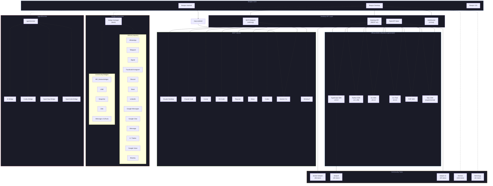
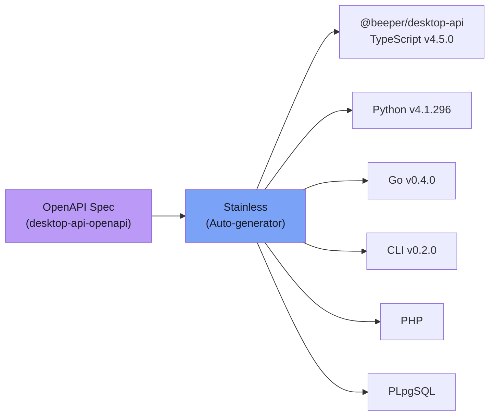
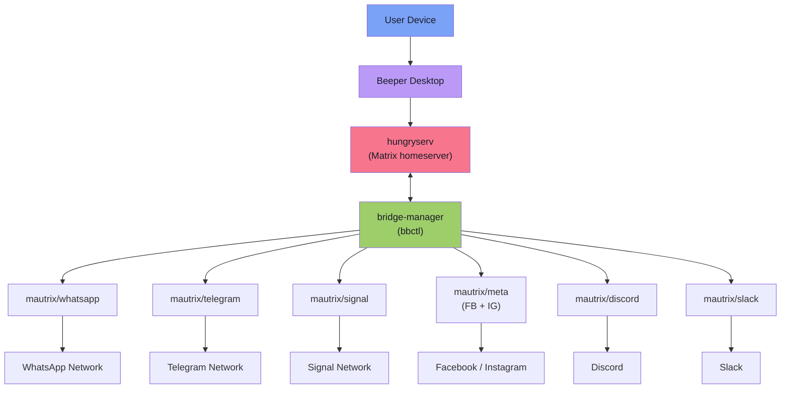
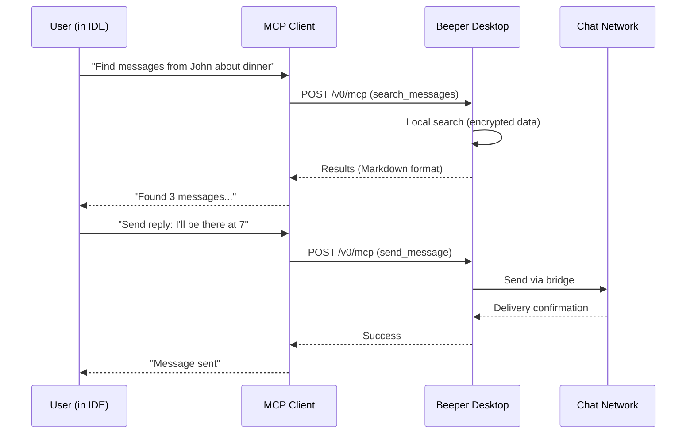

# Beeper Ecosystem Map

> A complete visualization of how Beeper's components interconnect: Desktop API, SDKs, bridges, MCP, AI agents, and community tools.

## Master Ecosystem Diagram

## SDK Generation Pipeline

## Bridge Architecture

## MCP Data Flow

## Component Count Summary

| Category | Count | Notes |
|----------|-------|-------|
| Official repos | 125 | 8 archived, 92 active |
| Community repos | 35+ | CLI tools, themes, bridges, MCP servers |
| Official SDKs | 6 | All Stainless-generated |
| MCP clients supported | 9 | Claude, Cursor, VS Code, Raycast, Warp, etc. |
| Official bridges | 13 | via mautrix |
| Community bridges | 5+ | IRC, LINE, Snapchat, Zalo, iMessage v2 |
| AI agent bridges | 4 | Codex, OpenClaw, OpenCode, generic AI |
| API endpoints | 21 | REST /v1 |
| MCP tools | 10 | search, list, send, archive, etc. |

## Cross-References

- [AgentRemote Analysis](agentremote-analysis.md) -- deep dive on the AI agent platform
- [Bridge Landscape](bridge-landscape.md) -- complete bridge listing
- [Community Intelligence](community-intelligence.md) -- developer ecosystem insights
